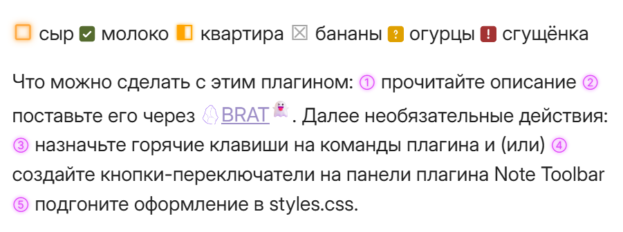
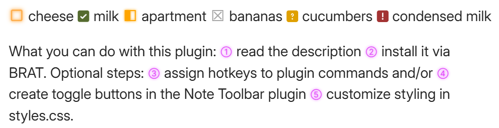

# Inline Checkboxes — Obsidian Plugin

This plugin transforms Unicode characters into stylized, interactive pseudo-checkboxes and numbered markers within a paragraph. **Note:** These checkboxes are NOT tasks and are not recognized by Obsidian or task plugins; they are purely for visual organization.

## Features

- **Inline checkboxes** — works anywhere in the text, not just in lists.
- **Click to toggle** — cyclic state changes.
- **Two independent cycles**:
  - Checkboxes: `▢ → ☑ → ◧ → ☒ → ⚠ → ⍰ → ▢`
  - Digits: `① → ② → ... → ⑩ → ... → ⑳ → ①`
- **Smart Numbering (v2.0.0):**
  - **Context-aware insertion:** The plugin finds the nearest preceding digit in the paragraph and automatically inserts the next one in the sequence.
  - **Auto-reindexing:** When you insert a digit in the middle of a row, all subsequent digits in that paragraph are automatically incremented to maintain the correct order.
- **Full Customization** — change colors, sizes, and glow effects via CSS variables.

## Checkbox States

| Symbol | State | Description |
|:------:|-----------|----------|
| `▢` | Empty | Not started (orange pulsing glow) |
| `☑` | Done | Completed (filled green square) |
| `◧` | In Progress | In work (half-filled) |
| `☒` | Cancelled | Cancelled/Rejected (gray) |
| `⚠` | Important | Needs attention (red square) |
| `⍰` | Question | Needs clarification (mustard square) |

## Circled Digits
`① ② ③ ④ ⑤ ⑥ ⑦ ⑧ ⑨ ⑩ ⑪ ⑫ ⑬ ⑭ ⑮ ⑯ ⑰ ⑱ ⑲ ⑳`

Use these for priorities, numbered steps, or ratings. You no longer need to track numbering manually — the plugin handles the sequence for you when inserting a new digit.

## Installation

### Manual
1. Download the latest release (`main.js`, `manifest.json`, `styles.css`).
2. Create a folder named `.obsidian/plugins/Yule-inline-checkbox/`.
3. Place the downloaded files into this folder.
4. Enable the plugin in **Settings → Community Plugins**.

### Via BRAT
1. Install the [BRAT](https://github.com/TfTHacker/obsidian42-brat) plugin.
2. In BRAT settings, click **Add Beta plugin**.
3. Paste the repository link: `https://github.com/Yu1e/obsidian-inline-checkbox.git`
4. Click **Add Plugin**, then enable **Inline Checkboxes** in the Community Plugins settings.

## Usage

### Commands (Command Palette)
- `Insert or toggle checkbox` — insert or switch a checkbox.
- `Insert or toggle circled digit` — insert the next sequential digit or toggle an existing one.

### Mouse Click
Click any checkbox or digit in the text to toggle its state. When switching digits, subsequent digits in the line will be automatically re-indexed.

## Customization
To change colors and sizes, edit the variables at the beginning of the `styles.css` file:

```css
:root {
  /* Checkbox Colors */
  --cb-empty:      #FF8C00;
  --cb-done:       #556b2f;
  --cb-progress:   #FFA500;
  --cb-cancelled:  #808080;
  --cb-important:  #CC0000;
  --cb-question:   #DFA000;

  /* Circled Digits */
  --cb-digit-color: #e040fb;
  --cb-digit2-color: #d4b0e0; /* For 10-20 */
}
```

### Integration with Note Toolbar
The JavaScript codes for inserting/toggling checkboxes and smart digits are provided separately: 
- [Checkbox button script](https://github.com/Yu1e/obsidian-yule-inline-checkbox/blob/7da7281e1785e958c9cc8f1dc5a82f4074a5d581/checkboxes-button-for-note-toolbar-plugin)
- [Smart digit button script](https://github.com/Yu1e/obsidian-yule-inline-checkbox/blob/7da7281e1785e958c9cc8f1dc5a82f4074a5d581/digits-button-for-note-toolbar-plugin)

## License
MIT

## Support
This plugin was created entirely by Claude (AI) upon request and under the guidance of the user.

### Contributing
This plugin will not be submitted to the official Obsidian plugin directory. If you find it useful, please feel free to fork it and publish your own version.

The author does not plan to actively develop this plugin. You are free to:
- Adapt the code to your needs.
- Create your own versions with additional features.
- Share improvements with the community.

---

# Inline Checkboxes — плагин для Obsidian

Плагин превращает Unicode-символы в стилизованные интерактивные псевдо-флажки и нумерованные маркеры внутри абзаца. Внимание! Флажки не являются задачами и не учитываются Обсидианом и плагинами задач, это чисто визуальное оформление.

## Возможности

- **Инлайн-чекбоксы** — не в списках, а в любом месте текста.
- **Клик для переключения** — циклическая смена состояний.
- **Два независимых цикла:**
  - Флажки: `▢ → ☑ → ◧ → ☒ → ⚠ → ⍰ → ▢`
  - Цифры: `① → ② → ... → ⑩ → ... → ⑳ → ①`
- **Умная нумерация (v2.0.0):**
  - **Контекстная вставка:** Плагин находит ближайшую предыдущую цифру в абзаце и автоматически подставляет следующую по порядку.
  - **Автоматический пересчет:** При вставке цифры в середину ряда все последующие цифры в этом абзаце автоматически увеличиваются, сохраняя правильную последовательность.
- **Полная кастомизация** — цвета, размеры, эффекты свечения через CSS-переменные.

## Состояния флажков

| Символ | Состояние | Описание |
|:------:|-----------|----------|
| `▢` | Пусто | Не начато (оранжевое пульсирующее свечение) |
| `☑` | Готово | Завершено (залитый зеленый квадрат) |
| `◧` | В процессе | В работе (залит наполовину) |
| `☒` | Отменено | Отменено/отклонено (серый) |
| `⚠` | Важно | Требует внимания (красный квадрат) |
| `⍰` | Вопрос | Нужно уточнение (горчичный квадрат) |

## Цифры в кружках
`① ② ③ ④ ⑤ ⑥ ⑦ ⑧ ⑨ ⑩ ⑪ ⑫ ⑬ ⑭ ⑮ ⑯ ⑰ ⑱ ⑲ ⑳`

Используйте для приоритетов, нумерованных шагов, рейтингов. Больше не нужно следить за нумерацией вручную — плагин сделает это за вас при вставке новой цифры.

## Установка

### Вручную
1. Скачайте последний релиз (`main.js`, `manifest.json`, `styles.css`).
2. Создайте папку `.obsidian/plugins/Yule-inline-checkbox/`.
3. Поместите скачанные файлы в эту папку.
4. Включите плагин в **Настройки → Сторонние плагины**.

Через плагин BRAT
1. Установите плагин BRAT.
2. В настройках BRAT нажмите Add Beta plugin.
3. Вставьте ссылку на этот репозиторий: https://github.com/Yu1e/obsidian-inline-checkbox.git
4. Нажмите Add Plugin, затем включите Inline Checkboxes в настройках сторонних плагинов.

## Использование

### Команды (палитра команд)
- `Insert or toggle checkbox` — вставить/переключить флажок.
- `Insert or toggle circled digit` — вставить следующую по порядку цифру или переключить существующую.

### Клик мышью
Кликните по флажку или цифре в тексте — состояние переключится. При переключении цифр последующие цифры в строке также будут пересчитаны.

## Настройка оформления
Для изменения цветов и размеров редактируйте переменные в начале файла `styles.css`:

### Использование с Note Toolbar
Коды для вставки и переключения флажков и умных цифр прилагается отдельно: 
- [кнопка для флажков](https://github.com/Yu1e/obsidian-yule-inline-checkbox/blob/7da7281e1785e958c9cc8f1dc5a82f4074a5d581/checkboxes-button-for-note-toolbar-plugin)
- [кнопка для цифр](https://github.com/Yu1e/obsidian-yule-inline-checkbox/blob/7da7281e1785e958c9cc8f1dc5a82f4074a5d581/digits-button-for-note-toolbar-plugin)

## Лицензия
MIT

## Поддержка
Плагин полностью создан Claude по запросу и под руководством пользователя.

### Участие в разработке
Этот плагин не будет отправлен в официальный каталог плагинов Obsidian. Если он кажется вам полезным — форкайте и публикуйте свою версию.

Автор не планирует активно развивать этот плагин. Вы можете свободно:
- Адаптировать код под свои нужды.
- Создавать собственные версии с дополнительными функциями.
- Делиться улучшениями с сообществом.
